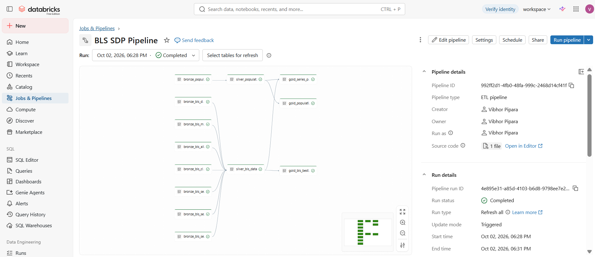
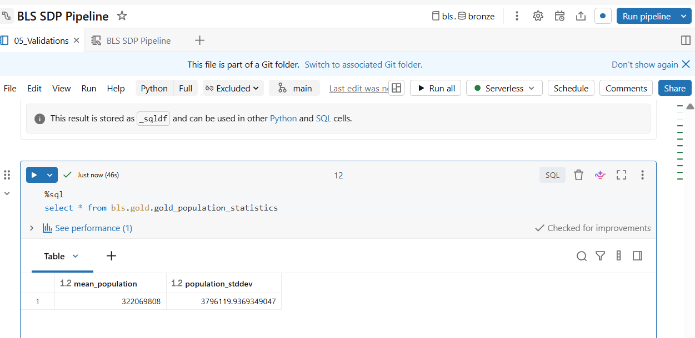
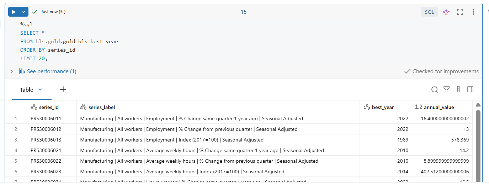
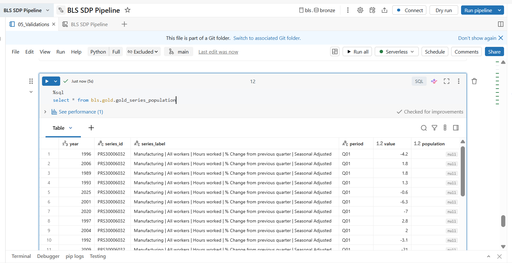
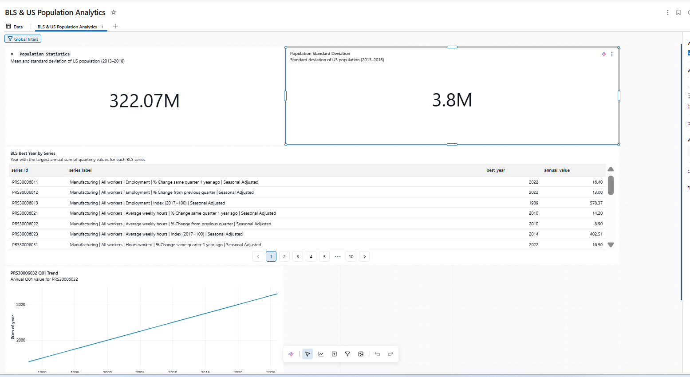
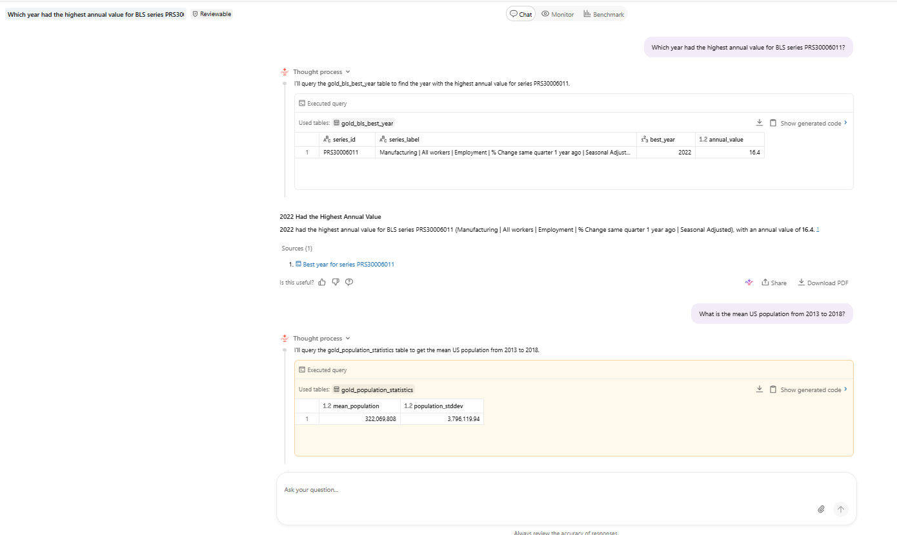

# BLS Productivity & US Population Data Engineering

## Overview

This project implements an end-to-end data engineering solution for ingesting U.S. Bureau of Labor Statistics (BLS) productivity data and U.S. population data, transforming the data through Bronze, Silver, and Gold layers in Databricks, and producing business-ready analytical outputs.

The project also includes a Databricks Genie Agent and dashboard as bonus deliverables.

## Architecture

```text
BLS Productivity Directory        DataUSA Population API
            |                              |
            +------------+-----------------+
                         |
                         v
                Unity Catalog Volume
                         |
                         v
                      Bronze
                         |
                         v
                      Silver
                         |
                         v
                       Gold
                    /         \
                   v           v
              Dashboard      Genie
```

## Technologies

- Databricks
- Spark Declarative Pipelines (SDP)
- Apache Spark
- PySpark
- Spark SQL
- Delta Lake
- Unity Catalog
- Unity Catalog Volumes
- Python

## Data Sources

### BLS Productivity Data

BLS productivity time-series files are dynamically discovered from:

`https://download.bls.gov/pub/time.series/pr/`

The complete directory contents are ingested into a Unity Catalog Volume.

The ingestion does not hardcode source filenames.

### DataUSA Population Data

U.S. population data is retrieved from the DataUSA API and stored as JSON in the same Unity Catalog Volume.

## Key Features

- Dynamic BLS source-file discovery
- BLS User-Agent handling for source access
- Raw file landing in Unity Catalog Volume
- Temporary download and validation before raw replacement
- Persistent ingestion control table
- Detection of new, changed, and removed source files
- Safe reruns without reprocessing unchanged files
- Retention of removed raw files for audit/history
- Explicit Spark schemas
- Bronze, Silver, and Gold architecture
- Data-quality expectations
- BLS metadata enrichment with human-readable series labels
- Spark SQL and PySpark implementations of analytical logic
- Databricks Genie Agent
- Databricks dashboard

## Unity Catalog Structure

```text
Catalog:
  bls

Schemas:
  bls.bronze
  bls.silver
  bls.gold

Volume:
  bls.bronze.bls_raw
```

Raw files are stored under:

```text
/Volumes/bls/bronze/bls_raw/raw/
```

The BLS ingestion control table is:

```text
bls.bronze.bls_file_control
```

## Data Layers

### Bronze

The Bronze layer represents source data in structured form with minimal transformation.

Main datasets include:

```text
bronze_bls_all_data
bronze_bls_series
bronze_bls_sector
bronze_bls_class
bronze_bls_measure
bronze_bls_duration
bronze_bls_seasonal
bronze_population
```

### Silver

The Silver layer cleans and enriches the Bronze data.

Key datasets:

```text
bls.silver.silver_bls_data
bls.silver.silver_population
```

BLS metadata tables are joined to create a human-readable `series_label`.

BLS `series_id` values are trimmed in Silver to handle fixed-width source values containing trailing spaces.

### Gold

The Gold layer contains the final business-oriented outputs:

```text
bls.gold.gold_population_statistics
bls.gold.gold_bls_best_year
bls.gold.gold_series_population
```

## Analytical Questions

### 1. US Population Statistics

Calculate the mean and population standard deviation of annual U.S. population for 2013–2018.

The calculation uses `AVG()` and `STDDEV_POP()`.

### 2. Best Year for Each BLS Series

For every BLS `series_id`:

- Sum `value` across quarters for each year.
- Identify the year with the largest annual sum.
- Include a human-readable `series_label`.

Output:

```text
series_id
series_label
best_year
annual_value
```

### 3. BLS Series and Population

For:

```text
series_id = PRS30006032
period = Q01
```

return the annual value and join it with the population for the corresponding year where population data is available.

A `LEFT JOIN` is used so that BLS records remain available when population data is missing.

## SQL and PySpark

Each analytical question is implemented in both:

- Spark SQL
- PySpark

Spark SQL is used as the primary implementation for the Gold datasets because the analytical requirements are naturally expressed using aggregations, joins, CTEs, and window functions.

The PySpark implementations are retained as alternatives demonstrating equivalent DataFrame-based logic.

## Data Quality

The SDP pipeline applies expectations for required fields such as:

- non-null `series_id`
- non-null `year`
- non-null `period`
- non-null `value`
- non-null population year
- non-null population value

Additional validation includes row counts, duplicate checks, metadata matching, and validation of the final Gold outputs.

## Safe Reruns

BLS ingestion uses:

```text
source_last_modified + source_size
```

to detect source changes.

Files are reprocessed when they are:

- new;
- changed;
- previously removed and later reappeared.

Unchanged files are not downloaded again.

Removed source files are marked as:

```text
SOURCE_REMOVED
```

while their raw copies are retained for audit/history.

## Project Structure

```text
BLS/
├── 01_Setup_Catalog_Schema
├── 02_BLS_Ingestion
├── 03_Population_Ingestion
├── 04_Check_File_Details
├── BLS_SDP_Pipeline
├── screenshots/
│   ├── 01_bls_sdp_pipeline.png
│   ├── 02_Q1_gold_population_statistics.png
│   ├── 03_Q2_gold_bls_best_year.png
│   ├── 04_Q3_gold_series_population.png
│   ├── 05_Dashboard.png
│   └── 06_Genie_Q&A.png
├── README.md
└── PROCESS.md
```

## Bonus Features

### Genie

A Databricks Genie Agent was configured using the Gold tables as the primary source for business questions.

The Genie instructions guide it to use the appropriate Gold dataset for population statistics, BLS best-year questions, and the `PRS30006032` population analysis.

### Dashboard

A Databricks dashboard was created using the Gold tables and includes:

1. Mean population
2. Population standard deviation
3. BLS best year by series
4. `PRS30006032` Q01 annual trend

## Screenshots

### BLS SDP Pipeline — Bronze → Silver → Gold



### Q1 — Population Statistics



### Q2 — Best Year by BLS Series



### Q3 — BLS Series Value with Population



### Analytics Dashboard



### Genie Natural-Language Q&A



## Documentation

For detailed implementation, architecture decisions, validation, trade-offs, production considerations, and retrospective, see:

**[PROCESS.md](PROCESS.md)**

## Final Outcome

The project demonstrates a complete data engineering workflow:

```text
Source
  ↓
Dynamic Ingestion
  ↓
Unity Catalog Volume
  ↓
Bronze
  ↓
Silver
  ↓
Gold
  ↓
Business Analytics
  ├── Dashboard
  └── Genie
```

The implementation focuses on reproducibility, safe reruns, data quality, clear separation of processing layers, and business-ready analytical outputs.
